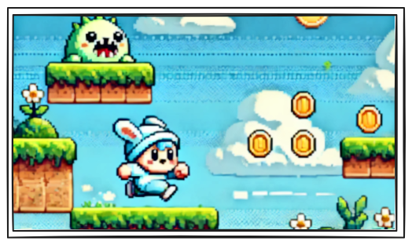
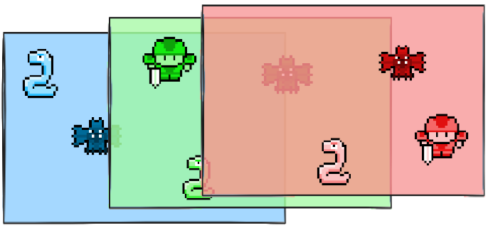

# GDPython - Eine  2D Game Engine 🕹️

GDPython ist eine QT6/Python basierte Game Engine für die einfache
Erstellung von einfachen 2D Spielen. GDPython unterstützt dabei Sprites und Animationen, Szenen-handling, Multi-Layer, Textdarstellung, Kollisionserkennung sowie Soundeffekten und Musik.

## 🗂️ Aufbau der Engine 

Die Engine basiert auf einer objektorientierten Struktur, in der Scene das zentrale Element ist. Die wichtigsten Komponenten sind:
___
### Scene:



Eine Szene dient als zentrale Umgebung für das Spielgeschehen. Sie enthält Layer, Objekte und Kameras und verwaltet die Interaktionen zwischen diesen Komponenten. Szenen können für verschiedene Zwecke genutzt werden, wie z. B. das Erstellen von verschiedenen Leveln, Menüs oder speziellen Spielbereichen. Durch den Wechsel zwischen mehreren Szenen kann das Spiel strukturierter aufgebaut werden.


**Deklaration einer Spielszene:**
```python
scene = Scene("Meine Spielszene", sizeX=1000, sizeY=1000, background="#000000") 
```
___

### InputHandler 


Der InputHandler ist dafür verantwortlich, Tastatureingaben zu erfassen und zu speichern.
Funktionalität des InputHandler

#### Erfassen von Tastendrücken (keyPressEvent):
Wenn eine Taste gedrückt wird, wird sie in keysPressed gespeichert.

#### Erkennen von Tastenfreigaben (keyReleaseEvent):
Wenn eine Taste losgelassen wird, wird sie aus keysPressed entfernt.

#### Konvertierung von Qt-Tasten zu Strings (qtKeyToString):
Übersetzt Qt-Tastencodes (Qt.Key_W, Qt.Key_Space, etc.) in Strings, damit sie leicht überprüft werden können. In späteren Versionen wird dies dazu Beitragen InGame Tastenbelegungen zu konfigurieren.

**Tasteneingaben werden über die Szene und durch den InputHandler verarbeitet:**
```python
if scene.isKeyPressed("w"):
    player.moveTowardAngle(90, 5)
```
___

## Layer



#### Was ist ein Layer?

Ein Layer ist eine Ebene, die Objekte gruppiert und strukturiert. Mehrere Layer übereinander ergeben die komplette Szene, genau wie mehrere Folien ein vollständiges Bild ergeben können.
Ein Layer in der Engine kann mit einer Folie in einem Grafikprogramm verglichen werden. Jedes Objekt im Spiel (außer Cameras und andere Layer) existiert nicht direkt in der Szene, sondern immer innerhalb eines Layers.

#### Warum werden Layer genutzt?

**Organisation**: Trennung von Spielobjekten, UI-Elementen, Effekten usw.

**Steuerung der Zeichenreihenfolge:** Objekte mit höherem z_index werden später gezeichnet und erscheinen über anderen Objekten.

**Bewegung & Transformation:** Alle Objekte innerhalb eines Layers können gemeinsam verschoben oder rotiert werden und jedes Objekt auf einem Layer kann
sich individuel verschieben proportional zu seinem Layer. Wir können also einen Layer dirket bewegen und alle Objekte die sich auf ihm befinden oder 
wir können mit einem Camera-Objekt einen Layer umpositionieren und verschieben.

**Einen Layer erzeugen:**
```python
scene = Scene("GameScene")
layer = Layer("MainLayer", 0, 0, z_index=1)
scene.addLayer(layer)
```

## Camera
Kameras sind die Elemente mit dennen man Layer verschieben kann. Sobald eine Kamera einem Layer zugewiesen wurde mit ```.setLayer(Layer)``` ist die entsprechende Kamera an diesen layer gebunden und der Layer wird sich immer proportional zu der Kamera bewegen.
```python
    def setLayer(self, layer):
        """Verknüpft die Kamera mit einem Layer"""
        self.layer = layer
```

Unterm Strich ist eine Kamera auch nur ein Objekt das sich in der Szenen bewegen
kann, rotiert werden kann. Sie unterscheidet sich zu anderen Objekten wie zb. Sprites nur in sofern das sie nicht in einem Layer erzeugt wird sondern direkt in der Szene. 

## RenderManager

Der Rendermanager ist die Klasse die es uns Erlaubt überhaupt erst ein Fenster zu generieren. Jede Instanz von RenderManager kann ein eigenes Fenster erzeugen.
Zudem verwaltet der RenderManager die verschiedenen Szenen:

```python
    def changeScene(Scene("newScene", sizeX=1000, sizeY=1000, background="#000000")):

```

## Objects

Objekte sind die Elemente aus dennen am Ende ein fertiges Spiel wird. Alle Objekte müssen einen einzigartigen Namen bekommen ```obj.name```, einer Position zugewiesen ```obj.posX``` und ```obj.posY``` sowie einen Z-Index  ```obj.z_index``` der die Reinfolge auf der Zeichenfläche bestimmt.
Layer, Kameras, Sprites, Texte und Sounds,  alle sind Objekte und besitzen diese Eigenschaften.

## Sprites 

Sprites sind in GDPython 2D Elemente. Sie sind in der lage Texturen und Animationen zu speichern und diese auch abzuspielen:

```python
    ship = Sprite("player",500, 500, 100, 16 , 16)
    ship.addAnimation("idle", ["rsc/ship.png"], loop=False , timeBetween=0)
    ship.playAnimation("idle")
    self.scene.defaultLayer.addObject(ship)
```

Dieser code würde ein Sprite mit dem namen player an der Position x:500 y:500 erzeugen mit einer reinfolge von z:100 und einer größe von 16x16 Pixel.

Dem Schiff würde dann eine Animation mit dem namen "idle" hinzugefügt werden, bestehnt aus einer Liste mit Bildern (hier nur ein Bild). loop gibt an ob sich die animation wiederholen soll und timeBetween wie viele milisekunden zwischen jedem Bild liegen.

Am Ende wird die Animation "idle" abegrufen und im anschluss wird das Schiff
in den defaultLayer der Szene gesetzt.


## Sound und Music

Im GDpython kann man auf zwei Arten Soundelemente in ein Spiel einbauen:

Mit Sound, wobei hier zu beachten ist das Sound für Effekte und Geräusche gedacht ist wärend Music für Hintergrund-Musik gedacht ist. 


**Sound:**
```python
    self.shootSound = Sound("Shoot", "rsc/Shoot.wav")
    self.shootSound.play()
```
**Music:**
```python
    self.spaceMusic = Music("rsc/Space.wav")
    self.spaceMusic.play()
```

Es ist zudem noch zu beachten das ein Sound element ein objekt ist; bedeutet es kann in einem Layer plaziert werden und positioniert werden.

## Timer

Bei Timern handelt es sich um individuelle Stopuhren die es ermöglichen sollen relativ leicht kontrolle über Zeitgesteuerte geschenisse zu erlangen. Zb. die Frequenz einstellen in der ein Raumschiff schießt.

```python
    def start():
        self.chronoShoot = Timer()
        self.chronoShoot.start()

    def update():
        if self.scene.isKeyPressed("space") and self.chronoShoot.getTime() > 1000:
            print("Das Raumschiff schießt")        
            self.chronoShoot.reset()
```

In diesem Beispiel würde beim drücken der Leertaste alle 1000 Millisekunden eine
nachricht erscheinen mit dem Text: "Das Raumschiff schießt".